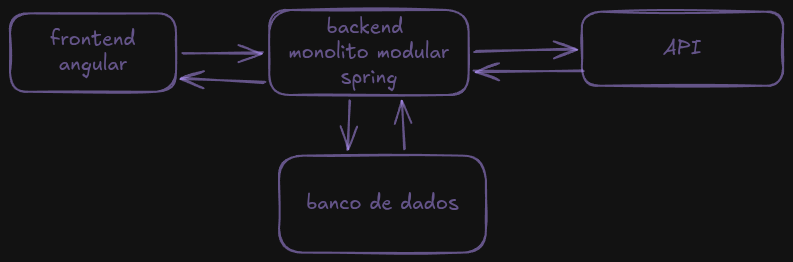

# System Architecture

## Architectural Style

JobRadar will initially use a **Modular Monolith**.



The internal code organization will follow **Clean Architecture** principles.

## Main Modules

The MVP contains exactly three main modules:

```text
job-radar
│
├── auth
├── users
└── jobs
```

### Auth

Responsible for:

* Registration
* Authentication
* Authentication tokens
* Authorization

### Users

Responsible for:

* User profile
* User skills
* User favorites

### Jobs

Responsible for:

* Job opportunities
* Job requirements
* External job sources
* Job ingestion
* Job retrieval
* Job matching

## External Job Sources

External sources will be accessed through infrastructure adapters.

```text
External Job API
       |
       v
Job Source Adapter
       |
       v
Application Port
       |
       v
Job Application
       |
       v
Job Domain
```

The Job domain must not depend directly on a specific external API.

## Architectural Principles

* Separation of concerns
* Dependency inversion
* Domain independence
* Explicit module boundaries
* Testability
* Maintainability
* Avoid premature complexity
